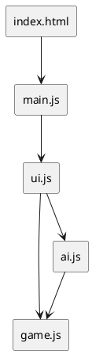
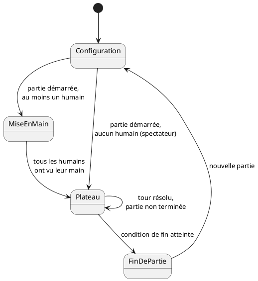
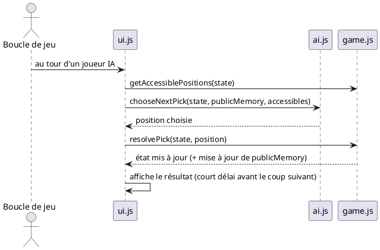

# Document de conception — Trio

Ce document décrit comment répondre au PRD (`docs/PRD.md`, approuvé). Il ne
couvre que ce qui est nécessaire pour un projet de cette taille (une poignée
d'écrans, un seul plateau de jeu).

## 1. Stack de développement

- **HTML / CSS / JavaScript vanilla**, sans framework ni bundler ni étape de
  build — cohérent avec `CLAUDE.md` et avec le besoin réel (un plateau de
  jeu, pas une application métier).
- Le JavaScript est organisé en **modules ES natifs** (`<script
  type="module">`), pour séparer clairement la logique de jeu, l'IA et
  l'affichage sans avoir besoin d'outillage. Conséquence : l'application
  doit être servie via un petit serveur HTTP local (`python3 -m
  http.server`, Live Server, etc.), l'ouverture directe en `file://` ne
  fonctionne pas avec les modules ES. C'est déjà l'usage recommandé dans le
  `README.md`.
- Aucune dépendance externe.

## 2. Vue d'ensemble de l'architecture

Quatre fichiers JavaScript, à responsabilité unique :

| Module     | Responsabilité                                                                 | Dépend de |
|------------|----------------------------------------------------------------------------------|-----------|
| `game.js`  | Logique pure du jeu : distribution, positions accessibles, résolution d'un tour, détection de fin/blocage. Aucun accès au DOM. | — |
| `ai.js`    | Décision d'un joueur IA : à partir d'une vue *honnête* de la partie (sa main + mémoire publique), choisit une position à révéler. | `game.js` |
| `ui.js`    | Rendu à l'écran, écoute des interactions humaines, orchestration des tours (y compris le rythme des tours IA). | `game.js`, `ai.js` |
| `main.js`  | Point d'entrée : initialise l'état et démarre `ui.js`.                          | `ui.js` |

`game.js` ne connaît ni l'écran ni l'IA : c'est le seul module qui doit
rester correct et testable indépendamment (y compris via un script Node
autonome, comme la simulation déjà utilisée pour valider la détection de
blocage).



### Écrans de l'application



Cas particulier (UC-2) : si un seul joueur humain est présent, l'écran
"MiseEnMain" est sauté — sa main est affichée directement et reste visible
en continu sur l'écran "Plateau", puisqu'aucun autre humain ne partage
l'écran.

## 3. Modèle de données (état de la partie)

```text
state = {
  screen,              // 'setup' | 'peek' | 'game' | 'end'
  players: [{
    name, type,         // type: 'human' | 'ai'
    hand: [cardId...],   // trié croissant
    trios: [value...],
  }],
  cards: { [cardId]: value },
  piles: [[cardId] | []],      // une carte par pile (0 ou 1 élément)
  currentPlayerIndex,
  revealed: [{ loc, cardId }], // cartes retournées dans le tour en cours
  publicMemory: { [positionKey]: value },  // voir §5
  endReason,            // 'trios' | 'exhausted' | 'stalemate'
  winners: [player...],
}
```

`positionKey` identifie une position stable dans le temps : `hand-<index
joueur>-left`, `hand-<index joueur>-right`, ou `pile-<index pile>`.

## 4. Algorithmes principaux

### 4.1 Répartition des cartes

Le nombre de cartes par main (`handSize`) est un paramètre de la partie,
choisi à l'écran de configuration (UC-1) :
- une valeur par défaut est suggérée selon le nombre de joueurs (mêmes
  valeurs qu'avant l'introduction du réglage : 6/5/4/4 pour 3/4/5/6
  joueurs) ;
- le joueur peut l'ajuster, dans les bornes `[1, ⌊35 / nombre de joueurs⌋]`
  — le plafond garantit qu'il reste au moins 1 carte pour la table ;
- changer le nombre de joueurs réinitialise `handSize` à sa valeur par
  défaut pour ce nouveau nombre de joueurs.

À la création de la partie : mélange des 36 cartes, puis distribution de
`handSize` cartes à chaque joueur, le reste (`36 - handSize × nombre de
joueurs`) formant des piles d'une seule carte sur la table. Chaque main est
triée par valeur croissante immédiatement après distribution (aucun choix
du joueur à faire ici, la règle impose cet ordre).

### 4.2 Résolution d'un tour

Machine à états simple pilotée par `state.revealed` :

1. `revealed.length === 0..1` → en attente d'une carte de plus, rien à
   trancher.
2. `revealed.length === 2` → comparer les deux valeurs :
   - différentes → fin du tour (échec), cartes remises face cachée ;
   - identiques → poursuivre, sauf si aucune position accessible restante
     ne peut fournir une 3ᵉ carte (alors fin du tour, échec).
3. `revealed.length === 3` → comparer la 3ᵉ valeur aux deux premières :
   - identique → trio remporté, cartes retirées, le joueur actif rejoue ;
   - différente → fin du tour (échec).

### 4.3 Détection de fin de partie

- **Victoire directe** : contrôlée juste après un trio remporté (3 trios ou
  trio de 7).
- **Épuisement** : plus aucune carte en jeu.
- **Blocage** : après toute fin de tour en échec (et après tout trio
  remporté qui ne déclenche pas de victoire directe), on vérifie si un
  futur trio reste atteignable. Algorithme par point fixe, exécuté sur une
  copie de travail des mains/piles :
  1. Calculer les positions actuellement accessibles.
  2. Si trois positions accessibles partagent la même valeur, les retirer
     virtuellement (elles libèrent la position suivante de leur main/pile).
  3. Répéter jusqu'à ce qu'aucun retrait ne soit plus possible.
  4. Si aucun retrait n'a eu lieu dès la première itération, la partie est
     bloquée : aucun trio n'est plus jamais atteignable.
     Cet algorithme est exact : une carte accessible non utilisée reste
     accessible indéfiniment (elle n'est retirée que si son trio se
     complète), donc l'approche gloutonne ne "gâche" jamais d'opportunité.
- Dans les deux cas (épuisement, blocage), le ou les joueurs ayant le plus
  de trios sont déclarés vainqueurs (égalité possible).

### 4.4 Mémoire d'information publique (`publicMemory`)

À chaque carte révélée (tour humain ou IA), sa valeur est enregistrée dans
`publicMemory` sous la clé de sa position. Cette information reste valable
tant que la position n'est pas modifiée. Elle est invalidée (entrée
supprimée) uniquement quand la carte à cette position est retirée du jeu
(trio complété) : une nouvelle carte, inconnue, occupe alors la position.

Ce journal représente exactement ce qu'un joueur humain attentif retiendrait
au fil de la partie ; c'est la seule source d'information sur les mains
adverses/la table autorisée pour une IA (règle d'équité du PRD).

### 4.5 Décision d'un joueur IA

Pour chacune de ses 1 à 3 révélations dans un tour, l'IA choisit une
position accessible selon cette priorité :

1. **Ouverture par exploration** : en tout début de tour (aucune carte
   encore révélée), s'il existe au moins une position accessible de valeur
   inconnue, en choisir une au hasard — révéler une carte déjà connue
   n'apprend rien (sa valeur est déjà sue) et fige immédiatement la cible du
   tour sur cette seule valeur. Explorer d'abord permet soit de tomber
   directement sur la cible d'une paire déjà connue (le tour se poursuit
   alors normalement via la règle 3), soit d'apprendre une information
   nouvelle dans le cas contraire — jamais moins bien que d'ouvrir sur une
   paire connue, potentiellement mieux.
2. **Ouverture par paire connue** : seulement si l'étape 1 ne s'applique pas
   (plus aucune position accessible de valeur inconnue), et s'il existe deux
   positions accessibles de valeur déjà connue et identique entre elles, en
   choisir une au hasard parmi toutes les paires connues disponibles (pas
   seulement la première trouvée, pour ne pas s'acharner sur une paire dont
   la 3e copie s'avère structurellement inaccessible — voir §4.5.1).
3. **Coup gagnant connu** : pour une 2e ou 3e révélation (une cible est déjà
   fixée par la 1re carte du tour), s'il existe une position accessible de
   valeur déjà connue correspondant à cette cible, la choisir.
4. **Exploration plausible** : sinon, pour une 2e ou 3e révélation,
   restreindre les positions inconnues à celles où la cible reste
   *plausible* au sens du filtre §4.5.1, puis en choisir une au sort,
   pondérée par la proximité de la cible au centre de la plage plausible de
   chaque position (§4.5.2) — une position n'est jamais totalement exclue,
   seulement moins probable en bord de plage.
5. **Repli** : si aucune des règles précédentes ne s'applique (aucune
   position ne satisfait les filtres), choisir aléatoirement parmi toutes
   les positions accessibles restantes.

Cette stratégie respecte strictement la règle d'équité (aucune donnée hors
main propre / `publicMemory`) tout en jouant "intelligemment" avec
l'information disponible, sans complexité algorithmique inutile pour ce
projet.

#### 4.5.1 Filtre de plausibilité par position

Chaque main est triée par valeur croissante ; c'est une règle du jeu, pas
une information cachée, et la **longueur d'une main est une information
publique** (le nombre de cartes qu'un joueur tient se voit sans rien
révéler). On peut donc borner, sans aucune triche, les valeurs qu'une
extrémité de main peut plausiblement porter :

- Une carte de rang *i* (1 = l'extrémité gauche) dans une main de longueur
  *L* doit avoir au moins *L - i* cartes de valeur supérieure ou égale
  **dans cette même main** (puisqu'elle est triée). Comme chaque valeur ne
  compte que 3 exemplaires dans tout le jeu, cela borne sa valeur maximale
  possible à `12 - ⌈(L - i) / 3⌉`, même dans le cas le plus favorable où
  ces exemplaires seraient tous réunis dans cette main.
- Symétriquement, sa valeur minimale possible est `1 + ⌈(i - 1) / 3⌉`.

Seules les deux extrémités d'une main sont jamais accessibles (i = 1 pour
la gauche, i = L pour la droite), donc en pratique :
- extrémité gauche (L ≥ 2) : valeur ≤ `12 - ⌈(L - 1) / 3⌉` ;
- extrémité droite (L ≥ 2) : valeur ≥ `1 + ⌈(L - 1) / 3⌉`.

Une main d'une seule carte, ou une pile de la table, n'a aucune contrainte
de ce type. Ce filtre généralise l'observation qui l'a motivé (avec des
mains de 4 cartes ou plus, l'extrémité gauche ne peut jamais valoir 12, ni
l'extrémité droite valoir 1) à toutes les valeurs et toutes les longueurs
de main.

*Non retenu* : un comptage exact des exemplaires connus/inconnus par valeur
(`connu[v]` / `inconnu[v]`) avait été envisagé en complément, mais s'est
révélé sans effet utile : au moment où l'IA recherche une 3e carte, elle a
par construction toujours exactement 2 exemplaires connus et 1 inconnu
(sinon la correspondance aurait déjà été trouvée par la règle 1) — le
calculer n'aurait changé aucune décision.

#### 4.5.2 Pondération par proximité au centre de la plage plausible

Le filtre de plausibilité (§4.5.1) élimine ce qui est *impossible*, mais
pas ce qui est simplement *improbable* : par exemple, pour l'extrémité
droite d'une main de 6 cartes, la plage plausible est `[3, 12]` — la valeur
4 y est techniquement possible (une main comme `{1,1,1,2,2,4}` est valide),
mais nettement moins probable qu'une valeur proche du centre de cette
plage. Une carte prise au hasard uniformément parmi toutes les positions
plausibles ignore cette nuance.

Sans aller jusqu'à un calcul combinatoire exact (écarté au §4.5.1 pour les
mêmes raisons de complexité), on pondère chaque position candidate par sa
distance au centre de sa propre plage plausible `[min, max]` :

```
centre = (min + max) / 2
demi-plage = (max - min) / 2
poids = max(0.15, 1 - |cible - centre| / demi-plage)
```

Le poids vaut 1 au centre de la plage et décroît linéairement jusqu'à un
plancher de 0,15 en bordure — une position en bord de plage reste
possible, juste moins souvent choisie. Les positions sans contrainte
(piles, mains d'une seule carte, plage `[1, 12]`) gardent un poids neutre
de 1. Le tirage se fait ensuite au sort, proportionnellement à ces poids.



## 5. Points d'attention pour l'implémentation

- `game.js` reste 100 % pur (pas de `document`, pas d'accès DOM) pour rester
  facilement testable en Node.
- `ai.js` ne doit recevoir qu'une vue de l'état compatible avec la règle
  d'équité (sa propre main + `publicMemory`), jamais l'état complet brut des
  autres mains — pour qu'une erreur d'implémentation future ne puisse pas
  silencieusement faire "tricher" l'IA.
- Le rythme des tours IA (délai entre chaque révélation) est un détail
  d'affichage géré par `ui.js`, sans impact sur `game.js`/`ai.js`.
